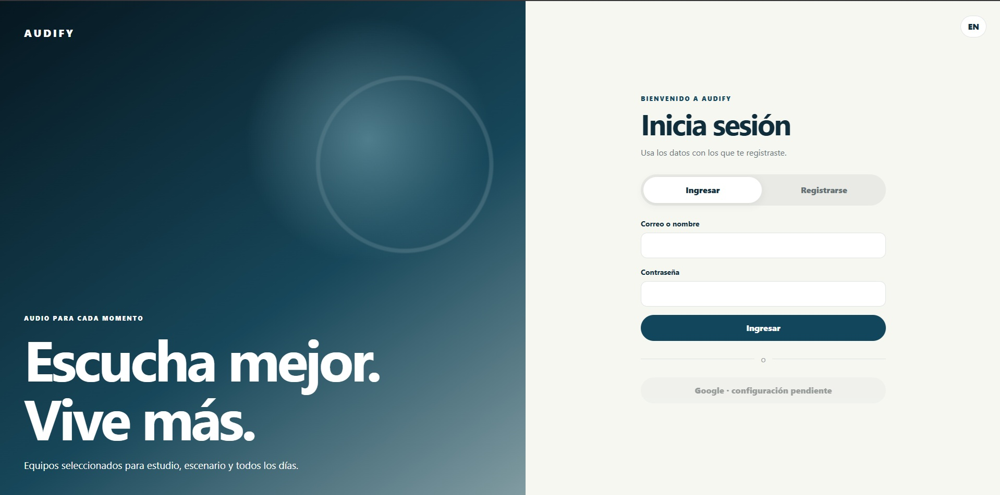
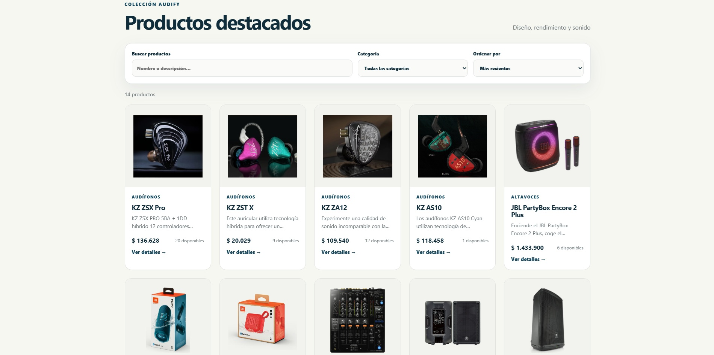
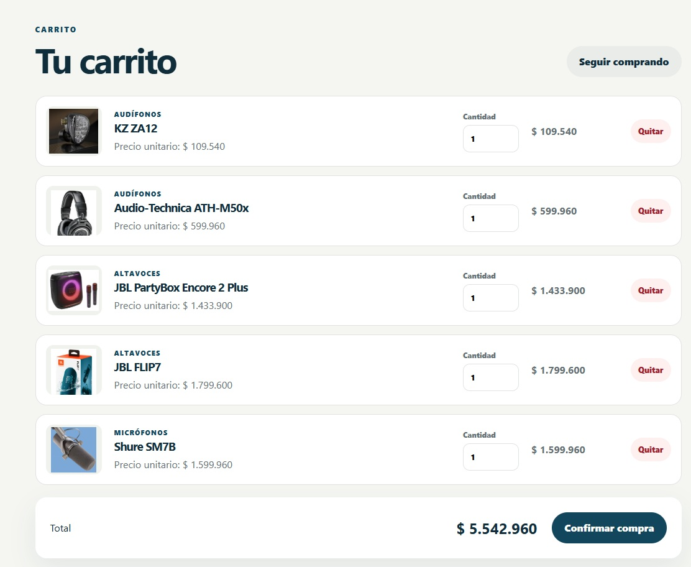
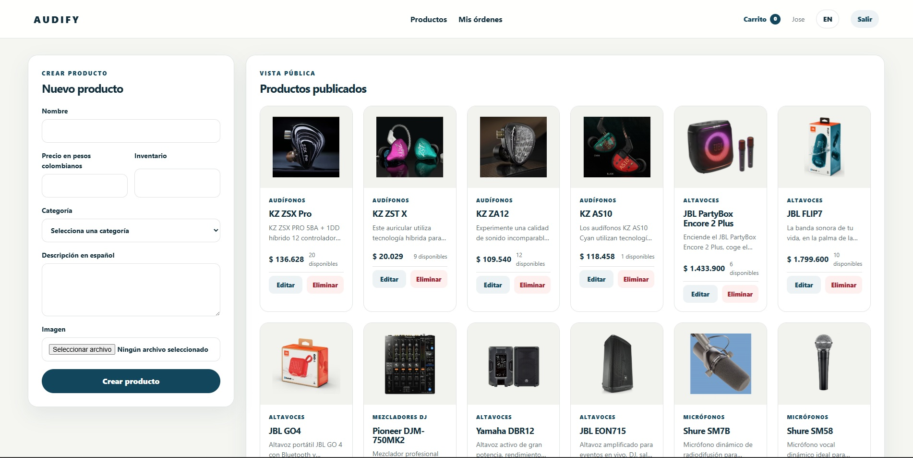

# Audify E-commerce Fullstack

Audify is a fullstack e-commerce platform for audio products.  
The project includes user authentication, product management, shopping cart, order system and an admin dashboard.

This project was built as a professional portfolio project to demonstrate fullstack development skills using React, Node.js, Express, PostgreSQL and Prisma.

---

## Live Demo

Frontend: Coming soon  
Backend API: Coming soon  

---

## Tech Stack

### Frontend
- React
- Vite
- CSS
- Axios
- React Router DOM

### Backend
- Node.js
- Express
- PostgreSQL
- Prisma ORM
- JWT Authentication
- Bcrypt

### Tools
- Git
- GitHub
- Postman / Thunder Client
- pgAdmin
- Hostinger / Deployment platform

---

## Features

- User registration
- User login
- JWT authentication
- Protected routes
- Customer and admin roles
- Product CRUD
- Product categories
- Product search
- Product filters by category and price
- Shopping cart
- Order creation
- Admin dashboard
- PostgreSQL database
- Prisma migrations
- Responsive frontend

---

## Screenshots

### Login



### Home



### Shopping Cart



### Admin Dashboard



---

## Project Structure

```txt
audify-ecommerce-fullstack/
├── client/
│   ├── public/
│   │   ├── favicon.svg
│   │   └── icons.svg
│   ├── src/
│   │   ├── assets/
│   │   ├── App.css
│   │   ├── App.jsx
│   │   ├── index.css
│   │   └── main.jsx
│   ├── eslint.config.js
│   ├── index.html
│   ├── package.json
│   └── vite.config.js
├── docs/
│   └── images/
│       ├── admin-dashboard.jpg
│       ├── home.jpg
│       ├── login.jpg
│       └── shopping-cart.jpg
├── server/
│   ├── prisma/
│   │   ├── migrations/
│   │   └── schema.prisma
│   ├── scripts/
│   │   └── createAdmin.js
│   ├── src/
│   │   ├── config/
│   │   ├── controllers/
│   │   ├── handlers/
│   │   ├── middleware/
│   │   ├── routes/
│   │   ├── utils/
│   │   ├── app.js
│   │   └── server.js
│   ├── package.json
│   └── prisma.config.ts
└── README.md
```
